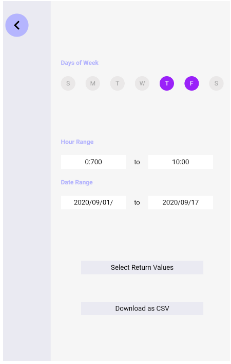
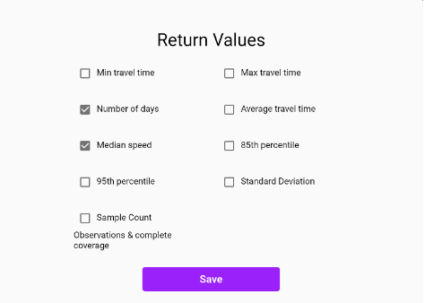

### Description 

The application we have created aims to provide a simple web interface so that consultants and traffic analysts (at Toronto Transportation Services) with non-technical backgrounds can acquire traffic data with ease. We have created a web-interface which creates queries by simple pin dropping on a map (similar to Google Maps) to create desired routes, and then a form to complete the rest of the parameters of the queries. By creating this application we allow the end-users (consultants and traffic analysts) to instantaneously and accurately acquire the data they need to make decisions. 

The context required to understand this application is: without it, the process for an inquiry requires  an engineer to manually transcribe written requests to an SQL query which can then be saved and emailed back to the inquirer. This system is clearly wasteful for time and resources, and can also cause problems when requests aren’t well defined to the engineer. The Vulcan solutions query form doesn’t allow for details to be left out and an engineer at TTS does not need to be involved tending to data requests, thus solving the problems described.

##  Key Features

The key features of this app accessible by users are: \
	1. Adding Nodes to map \
	2. Deleting the first Node from the map (via right click for now) \
	3. Generating a CSV output file for the selected route

The current feature set provides the most basic functionality for a map. It is important to note that creating a node on the map snaps the node to the closest droppable coordinate. This restricts the user input and ensures extraneous routes are not created. The current delete route functionality deletes the first node (visualized by coloring the segment black) and this ability ensures any route can be deleted allowing users to start over when necessary. Lastly, the CSV generated file contains the crux of the use for this application; it allows users to download the data for the selected geometry. 

It is important to note that the backend was focused on for this deliverable and backend implementations for modifying intermediate node coordinates, and handling multiple routes have been completed and tested. The full backend suite was demonstrated to the partner by running our tests cases and showing response bodies for example Postman requests.

The mockups for the MVP, which was the focus for this deliverable can be found here: https://www.figma.com/file/1VpJJ2yWHb7jmQaY8ECLuV/Toronto-Big-Data-MVP-Mockup?node-id=0%3A1

## Instructions

**NB: In the current state of the project, anyone can access the deployed version of the application.**

Access the deployed application here: [http://traffic-finder-static.s3-website.us-east-2.amazonaws.com/](http://traffic-finder-static.s3-website.us-east-2.amazonaws.com/)  

A demo video can be found here: https://drive.google.com/file/d/1F75BpZHG3WnCrs5lg8FTTNg4UOYKPfkS/view?usp=sharing

1a.Click anywhere on the screen to create select a location (wait a a few seconds - this will depict the nearest valid node to the desired location)

1b. Click on a different location to perform step 1, which will depict a new node and the path between the two nodes on the map.

2. After building a path, click the chevron on the top left to open the overlay menu

3. In the menu, a user can specify a few attributes to download about the path they’ve drawn. (Figure A). The hour range and date range is fixed
    1. Days of the week
    2. Return Values
4. ‘Return Values’ Opens up a modal that allows the user to further specify data about their chosen path.
5. Once the user is satisfied with their chosen days of the week and their selected return values (Figure B), they can hit “download csv” to save a table of data about their drawn path. (hitting this button won't do anything in the front-end since this functionality is only implemented in the back-end at this stage).

6. The ability to delete a node from a route is currently depicted by right-clicking on a node/location marker. This will colour the segment corresponding to the first node in the path in black, denoting it's been deleted. If multiple nodes are in the path, the user can right click on the last node of a path  multiple times, until all nodes have been marked in black - this would mean the entire route has been marked as deleted.

    

Figure A - Side Menu

    

Figure B - Return Values Modal

## Development requirements

The application can be run on Windows, Mac, and most flavors of Linux. The base requirements for this application are postgres (version 9.1+, must have extension postGIS and PGRouting), python3, DynamoDB virtualizer, and node.js. Specific requirements for python3 and Re-act are listed in a requirements.txt file and package.json files respectively. The guide below will help you install these dependencies.

Setting up application for personal machine (Mac OS and Linux guide. Tested on Catalina, High Sierra, and Ubuntu): \
Preliminary setup: To begin install homebrew. This can be done by following the guide here: [https://docs.brew.sh/Installation](https://docs.brew.sh/Installation) \
===========================Frontend Setup=========================== \
1. In terminal, type the command `brew install yarn` which will install yarn; an updated package manager similar to npm \
2. In the Frontend directory, run a new terminal and install the required dependencies via: `yarn install` \
3. After this is complete, the application can be run by the command `yarn start`

===========================Backend Setup=========================== \
This application requires the extensions PGRouting, PLPGSql, and PostGIS for PostGres. The application is configured to run with Postgres version 13.1 (the latest version of psql with support of all 3 applications). \
1. Install postgres version 13.1. Check your postgres version using `psql -V` (requires the default postgres launcher). To install postgres, use command `brew install postgres@13` \
2. Install psql extension ‘PGRouting’ via command `brew install pgrouting`. PGRouting has dependencies on PostGIS and PLPGSql which will be auto-installed if your machine does not currently have the extensions available \
3. In the backend directory here, run a new terminal and use the commands: `brew install python3` \
4. Now install python dependencies for the project by running `pip3 install -r requirements.txt` \
5. Download the Dynamo Emulator via: [https://docs.aws.amazon.com/amazondynamodb/latest/developerguide/DynamoDBLocal.DownloadingAndRunning.html](https://docs.aws.amazon.com/amazondynamodb/latest/developerguide/DynamoDBLocal.DownloadingAndRunning.html) \
6. Download the AWS CLI Version 2 via: \
[https://docs.aws.amazon.com/cli/latest/userguide/cli-chap-install.html](https://docs.aws.amazon.com/cli/latest/userguide/cli-chap-install.html) \
7. Run command `aws configure` and follow prompts to provide security credentials (ask an administrator for your Access Key ID and Secure Key Credentials). For region, type in ‘us-east-2’, and the rest of the fields can be left blank. \
8. Download the dataset for postgres: \
[LINK NEEDED] \
9. Run postgres, create a database named “trafficfinder” and import the dataset to the database. Do not worry about role not found errors. \
10. Start DynamoDB on your computer (use instructions from download link) \
11. Run migrations to configure the server via: `python3 manage.py makemigrations && python3 manage.py migrate` \
12. Start the server by running `python3 manage.py runserver`  \

## Deployment and Github Workflow 

We segmented our work into frontend and backend teams which rely on a documented API to allow the teams to have an accepted language of communication. Internally, the naming conventions used by the teams conform to the language standards. The backend, which is written in Django, uses Pep-8 standards (applied via pylint8) while the frontend team, which writes in React, uses the React Standard which is enforced via JSLint.

Our main branch consists of complete functional code which is able to run without errors. To create new features, the Trello board should indicate the feature is in progress. The card should contain a link to the new branch created for writing the code. 

For backend, the acceptance criteria for merging the branch to main requires the addition of at least one test case checking the feature. The PR request should indicate details about the feature worked on, and any additional testing required (other than the traditional test command). Sarthak is incharge of PR requests as he coordinates with the front and backend teams to coordinate API requests.

For Frontend, the acceptance criteria for merging the branch is purely visual and the app should run without warnings or errors. Again, the PR request should indicate any tests (clicking on various buttons, ensuring menus hide, etc.) needed. Although the frontend is mainly pair programmed by Shesei and Sherman and thus does not always require a heavy body. There is no one person in charge of PR requests for backend, but at least one reviewer is required for any merge.

We are using AWS codebuild and code pipelines for automatic deployment for both our frontend and backend. Codebuild builds are triggered by a hook invoked on commits in a main branch in either repository, which dump build artifacts to S3 buckets after running unit/integration tests and creating optimized production builds. From there, the deployment process changes between frontend and backend.

Frontend: \
As our frontend consists of static build artifacts, they are directly hosted from S3. This allows for low latency on our website. Passing the codebuild pushes changes directly to our endpoint. The frontend makes requests to the backend which is hosted on a separate EC2 instance.

Backend: \
Our pipeline automatically sends build artifacts to elastic beanstalk which starts executing instructions in our .ebextensions which performs the following operations:

1. launches an ec2 instance using a custom Amazon VMI containing binaries for spatial libraries needed to run GeoDjango on our backend:
    1. GEOS
    2. PROJ.4
    3. GDAL
    4. POSTGIS
2. Does any required database migrations and initializes default tables if not already present (imports db etc.). This process only occurs during the first migration on a server.
3. Invokes a WSGI callable to start the server and start redirecting incoming traffic to the correct port
    5. When the server starts, it pulls environment and configuration information from AWS secrets manager (API keys, table names, api endpoints)
4. If deployment is not successful, a rollback procedure is initiated which pushes the backend to the earliest working legacy application
5. Otherwise, old ec2 instances are terminated and re-released with updated builds.

## Licenses

What type of license will you apply to your codebase?

MIT license

What affect does it have on the development and use of your codebase?

It means that the codebase would be licensed as an open source software, which means that anyone can access and reuse the code freely. Similarly, it means the code will be publicly visible on github, and anyone can pull their own version of the codebase.

However, this doesn’t mean they could affect the software infrastructure that has been configured by our team for our partner per se. We are putting all keys and tokens that connect the code to our software infrastructure under environment variables which are set privately, and which only our team or our partner’s team have access to. 

So, even if the project is open source, other people could not affect our servers, databases, etc. They would need to configure their own software infrastructure environments and point the codebase and environment variables to it in order for the software to run. This means, they would need to set up their own services such as vpc, keystore, IAM roles, databases, load balancers, ec2 instances, among others. This way they would have their own software infrastructure environment, independent from our partner’s while being able to reuse the code.

Thus, keeping in mind our partner’s intention to make the project open source but also maintain the security and restrictive access to their software services, throughout our development we need to focus on setting all the environment variables that would allow access to these services privately. This is especially important in the back-end, since that’s where many of these services are used. Furthermore, when we complete the project, we need to make sure that the repositories are public, having clear documentation and a clean codebase for reusability.

Why did you or your partner make this choice?

Our partner made the choice of licensing this as an open source project with the intention of sharing the work with whomever it might be useful to. It is a way to minimize the number of times the wheel needs to be reinvented and to generate goodwill for their company. Our partner is not expecting outside contributors for their project or creating a new standard technology that people can use and build on. Having it open source is mainly based on allowing others to freely use the code and adapt it to their needs.

Regarding the specific open source software license chosen by our partner, the MIT license is one the most common ones, if not the most common one. It is one of the most permissive in terms of code reusability, allowing people to do almost anything they want with the code such as reusing it and distributing their own versions of it, as long as they provide a license and copyright notice.

There are many projects that use this license, some examples include Babel, .NET Core, and Rails use the MIT License.
